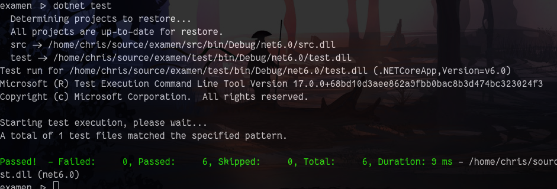

# Explicación

## Metodo 1
```cs
public string Metaverso(int x) => 
    (x % 3, x % 5) switch {
        (0, 0) => "Metaverso",
        (0, _) => "Meta",
        (_, 0) => "Verso",
        _ => $"{x}"
    };
```

Usamos *pattern matching* para retornar el valor apropiado de forma concisa.

## Metodo 2
```cs
public string Metaverso(int[] xs) => xs.Aggregate("", (acc, x) => acc + Metaverso(x));
```

Agregamos los resultados de la aplicación del primer método a cada valor de la lista a una cadena de caracteres.

## Demostración de Pruebas

